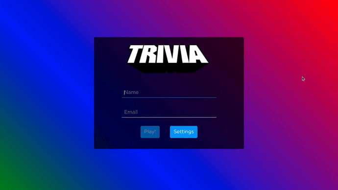

### Observação

Este repositório contem o **Projeto React Game Trivia** que reúne o aprendizado desenvolvido por _[Willian Alves Batista](https://www.linkedin.com/in/willian-alves-batista-60aa6a180/)_ enquanto estudante da [Trybe](https://www.betrybe.com/) :rocket:
**GitHub [Trybe](https://github.com/tryber)**.

# Projeto Game Trivia
### Resultado obtido:
### Deploy/ github pages do Projeto: [Game Trivia](https://willianbatist.github.io/project-game-trivia/)

#### Habilidades que foram exigidas:

  - Fazer requisições e consumir dados vindos de uma `API`;
  - Utilizar os ciclos de vida de um componente React;
  - Utilizar o Switch e React Router;
  - Criar um store Redux em aplicações React;
  - Criar actions no Redux em aplicações React;
  - Criar dispatchers no Redux em aplicações React;
  - Conectar Redux aos componentes React;
  - Criar actions assíncronas na sua aplicação React que faz uso de Redux.

---

## Apresentação do Projeto

### Introdução

O Projeto Game Trivia busca recriar os clássicos jogos de perguntas. Nesse projeto, foram utilizadas as seguintes tecnologias: ReactJS, Redux (actions, reducers, etc…), React Router e para gerar as perguntas foi utilizado a [API Trivia](https://opentdb.com/api_config.php). API gera perguntas de várias categorias e níveis de dificuldade diferentes, sendo possível combinar categorias com níveis de dificuldade, para só gerar perguntas ao qual foi especificada. Com esse projeto busco apresentar todo o conhecimento aprendido até o presente momento em Front-End, e me testar em relação aos desafios de criar uma página web dinâmica, que recebe várias interações do usuário, e graças ao Redux lida muito bem com a passagem de informações entre componentes React.

### 2. Tela Inicial

  A primeira página exibida é a tela de login, onde são requeridos os dados de nome e e-mail, caso o e-mail esteja cadastrado no [Gravatar](https://pt.gravatar.com/) e a pessoa estiver uma foto no site, na tela do jogo Trivia terá a foto do usuário. A tela inicial também possui o botão de play que inicia o jogo e o botão Settings que dá acesso a página de configurações.

### 2.1 Play!

Após preencher o nome e o e-mail, o botão Play será habilitado e, se clicado, inicia o jogo. Na tela do jogo, é apresentada a foto do usuário, o nome e o score que muda conforme os acertos no jogo. No meio da tela é mostrada a categoria, a pergunta e os botões com as alternativas de cada pergunta. Já na parte inferior, fica contido o cronômetro que define o tempo necessário para responder a pergunta, se o mesmo chegar a zero, a resposta será considerada errada. Sempre ao final do tempo ou ao clicar em umas das alternativas, o botão next aparecerá na página, para seguir o jogo até a próxima questão e chegar ao final das perguntas, onde o usuário encontrará a tela de FeedBack.

### 2.2 Tela de FeedBack

Nesse momento, a página mostra quantos pontos o jogador teve, a quantidade de questões certas e mais dois botões: 'Play again' para jogar de novo e o botão 'Ranking' que mostra o ranking dos jogadores anteriores. O Ranking dos jogadores é salvo no LocalStorage para que fique salvo sempre que a pessoa sair e voltar a jogar.

#### Conclusão

O Projeto Game Trivia ainda está em desenvolvimento e recebendo melhorias, a página de configuração está em desenvolvimento, pois ainda possui alguns bugs. Esse projeto foi realizado em grupo em colaboração de [Antônio Augusto](https://github.com/Toineto), [Samuel De Alencar](https://github.com/SamuelDAlencar) e para organizar as tarefas em uma equipe foi necessário aplicar uma metodologia ágil, o kanban. Pequenas partes estão sendo entregues para que possa receber feedback e sofrer melhorias mais rápidas, assim podemos entender se estamos indo no caminho certo ou não. O desafio de realizar esse projeto me ajudou a alavancar minhas hard skills de ReactJS, melhorar consideravelmente minha lógica de programação e entender muito bem como uma metodologia ágil contribui numa equipe de desenvolvedores.
  
---
### Trybe

_"A Trybe é uma escola do futuro para qualquer pessoa que queira melhorar de vida e construir uma carreira de sucesso em tecnologia, onde a pessoa só paga quando conseguir um bom trabalho."_
